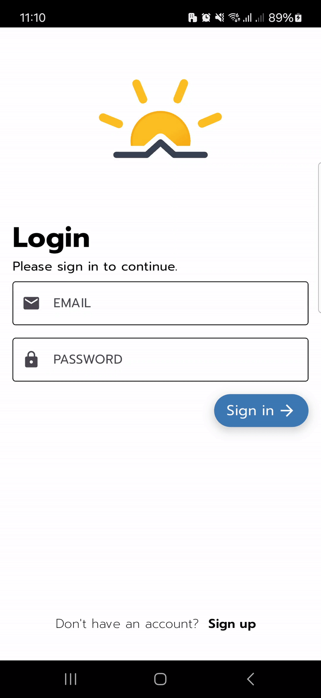
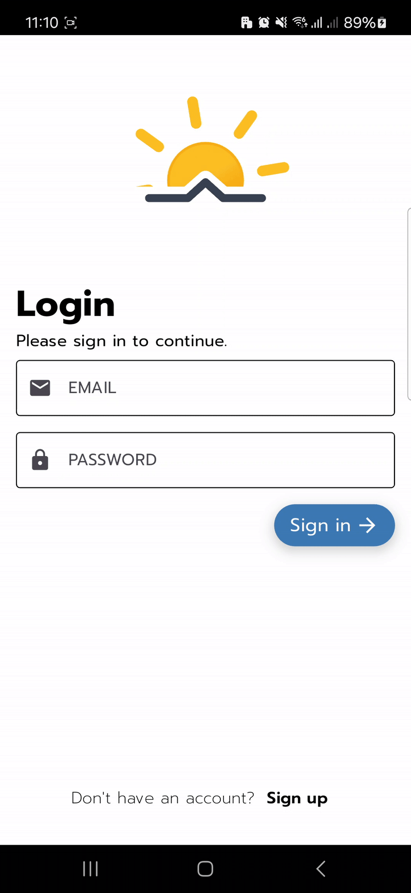

# Flutter Airnow

แอปพลิเคชัน Flutter สำหรับดูข้อมูลคุณภาพอากาศจากบริการ AirNow API

## รายละเอียดโปรเจกต์ 

`flutter_airnow` เป็นแอปตัวอย่างที่ดึงข้อมูลคุณภาพอากาศ (AQI) ผ่าน API ของ AirNow  
เน้นการใช้งาน Flutter ในการสร้าง UI และการเชื่อมต่อ API แบบเรียลไทม์

This project is a Flutter application that fetches real-time air quality data (AQI) using the AirNow API service.

## ฟีเจอร์

- เรียกดูคุณภาพอากาศตามตำแหน่งปัจจุบัน
- ค้นหาข้อมูล AQI ตามเมือง/สถานที่
- แสดงค่าดัชนีคุณภาพอากาศ (AQI) และคำแนะนำเบื้องต้น
- อินเทอร์เฟซผู้ใช้งานเรียบง่ายและทันสมัย

## เทคโนโลยีที่ใช้

- [Flutter](https://flutter.dev/) 
- [Dart](https://dart.dev/)
- [IQAir AirVisual API](https://api-docs.iqair.com/?version=latest#intro)
- [HTTP Package (Flutter)](https://pub.dev/packages/http)

## การติดตั้ง

### ความต้องการเบื้องต้น (Prerequisites)

- ติดตั้ง Flutter SDK [ดูวิธีที่นี่](https://flutter.dev/docs/get-started/install)
- ลงทะเบียนเพื่อขอ API Key ที่ [IQAir AirVisual API](https://dashboard.iqair.com/personal/api-keys)

### วิธีติดตั้ง

1. Clone โปรเจกต์นี้

```bash
git clone https://github.com/ParadornR/flutter_airnow.git
cd flutter_airnow
```

2.ติดตั้ง dependencies
```bash
flutter pub get
```
3.ตั้งค่า API Key ของคุณในโปรเจกต์
4.รันแอปพลิเคชัน
```bash
flutter run
```

## โครงสร้างโปรเจกต์ 
```bash
lib/
└── app/
    ├── data/                # ชั้นข้อมูล (Data Layer)
    │   ├── models/          # โมเดลของข้อมูล
    │   ├── providers/       # การจัดการ state (เช่น Provider, Riverpod)
    │   └── repositories/    # การติดต่อ API หรือแหล่งข้อมูล
    │
    ├── ui/                  # ชั้น UI
    │   ├── create/          # หน้าสร้างข้อมูลใหม่
    │   ├── detail/          # หน้ารายละเอียด
    │   ├── home/            # หน้าโฮม (หน้าหลัก)
    │   ├── loading/         # หน้าโหลดข้อมูล
    │   ├── login/           # หน้าล็อกอิน
    │   ├── profile/         # หน้าโปรไฟล์
    │   ├── register/        # หน้าสมัครสมาชิก
    │   └── widget/          # วิดเจ็ต UI ย่อยที่นำมาใช้ซ้ำ
    │
    └── main.dart            
```
## ตัวอย่างหน้าจอแอป 

### 🔐 หน้าล็อกอิน | 📝 สมัครสมาชิก 

<p float="left">
  
  
</p>

### 🏠 หน้าหลัก | 📄 หน้ารายละเอียด 

<p float="left">
  
  
</p>

### 📍 สร้างข้อมูลด้วยการระบุสถานที่ หรือ GPS ในการระบุตำแหน่ง

<p float="left">
  
  
</p>

## เครดิต (Credits)
ข้อมูล AQI และ Polution จาก [IQAir AirVisual API](https://api-docs.iqair.com/?version=latest#intro)
